# MerkleAirdrop Smart Contract Explanation

```mermaid
graph TD
    %% Definición de los nodos
    A[Contract: MerkleAirdrop] --> B[State Variables]
    A --> C[Constructor]
    A --> D[Functions]
    A --> E[Custom Errors]
    A --> F[Imports]
    
    %% Importaciones
    F --> F1[OpenZeppelin: IERC20]
    F --> F2[OpenZeppelin: SafeERC20]
    F --> F3[OpenZeppelin: MerkleProof]

    %% Variables de estado
    B --> B1[claimers: address list]
    B --> B2[i_merkleRoot: bytes32]
    B --> B3[i_airdropToken: IERC20]
    B --> B4[s_airdropClaimed: mapping address to bool]

    %% Constructor
    C --> C1[merkleRoot: bytes32]
    C --> C2[airdropToken: IERC20]

    %% Funciones
    D --> D1[claim: claimerAccount, amountToClaim, merkleProof]
    D1 --> D2[Verifica si ya se han reclamado tokens]
    D1 --> D3[Calcula el hash del nodo hoja]
    D1 --> D4[Verifica la validez del Merkle proof]
    D1 --> D5[Registra la reclamación en s_airdropClaimed]
    D1 --> D6[Emite el evento Claimed]
    D1 --> D7[Transfiere tokens con SafeERC20.safeTransfer]

    %% Errores personalizados
    E --> E1[MerkleAidrop__InvalidProof]
    E --> E2[MerkleAirdrop__AlreadyClaimed]

    %% Estilo básico
    style A fill:#f9f,stroke:#333,stroke-width:4px
    style B fill:#bbf,stroke:#333,stroke-width:2px
    style C fill:#cfc,stroke:#333,stroke-width:2px
    style D fill:#ccf,stroke:#333,stroke-width:2px
    style E fill:#ffc,stroke:#333,stroke-width:2px
    style F fill:#fbb,stroke:#333,stroke-width:2px
```


This is an Ethereum smart contract that implements an ERC20 token airdrop using a Merkle tree to verify the validity of claims. 

- Here's a breakdown of the contract:

## Name and Version

- The contract is named ``MerkleAirdrop`` and uses Solidity version``0.8.24``.

## Imports

- The contract imports two ``OpenZeppelin`` libraries:

- ``IERC20`` and ``SafeERC20`` for working with ERC20 tokens securely.
- ``MerkleProof`` for verifying the validity of Merkle proofs.

## Custom Errors

The contract defines two custom errors:

- ``MerkleAidrop__InvalidProof``: thrown when the Merkle proof is invalid.
- ``MerkleAirdrop__AlreadyClaimed``: thrown when an account attempts to claim tokens that have already been claimed.

## State Variables

The contract has the following state variables:

- claimers: a list of addresses that can claim tokens.
- i_merkleRoot: the root of the Merkle tree used to verify the validity of claims.
- i_airdropToken: the ERC20 token being airdropped.
- s_airdropClaimed: a mapping that tracks which accounts have claimed tokens.

## Constructor

The constructor takes two parameters:

- merkleRoot: the root of the Merkle tree used to verify the validity of claims.
- airdropToken: the ERC20 token being airdropped.

## claim Function

The claim function is the main function of the contract. It is used to claim tokens and verify the validity of the claim using the Merkle tree. The function takes three parameters:

- claimerAccount: the account claiming tokens.
- amountToClaim: the amount of tokens being claimed.
- merkleProof: the Merkle proof used to verify the validity of the claim.

### The function performs the following actions:

- Verifies that the account has not already claimed tokens.
- Calculates the hash of the leaf node of the Merkle tree using the account and the amount of tokens being claimed.
- Verifies that the Merkle proof is valid using the MerkleProof.verify from openzeppelin function.
- Records that the account has claimed tokens in the ``s_airdropClaimed`` mapping.
- Emits a Claimed event to notify that the account has claimed tokens.
- Transfers the ERC20 tokens to the claimer's account using the SafeERC20.safeTransfer function.

In summary, this contract implements an ERC20 token airdrop using a Merkle tree to verify the validity of claims. The claim function is the main function of the contract and is used to claim tokens and verify the validity of the claim.

# Key explanation of the following line of code in the main function (claim)
```javascript
bytes32 leaf = keccak256(bytes.concat(keccak256(abi.encode(claimerAccount, amountToClaim))));
```

## What's happening in the code?

The code can be broken down into three steps:
 
- ``abi.encode(claimerAccount, amountToClaim)``: the pair of values ``claimerAccount`` and ``amountToClaim`` is encoded into a byte sequence according to the ABI format.

- ``keccak256(...)``: the keccak256 hash function is applied to the resulting byte sequence from step 1, producing a 256-bit hash.

- ``keccak256(bytes.concat(...))``: the keccak256 hash function is applied again to the result from step 2, but this time the result is concatenated with an empty byte sequence (bytes.concat(...)). This produces a second 256-bit hash.

## Why is the hash function applied twice?

The reason the hash function is applied twice is to prevent collisions. A collision occurs when two different inputs produce the same hash. By applying the hash function twice, the probability of a collision is reduced..

In particular, this technique is known as a ``"second preimage attack``". Although the name may be misleading, what's being done is to prevent an attacker from finding a second input that produces the same hash as the original input.

In summary, the code is generating a hash of a pair of values using the keccak256 hash function twice, which helps to prevent collisions and ensure the security of the operation.


