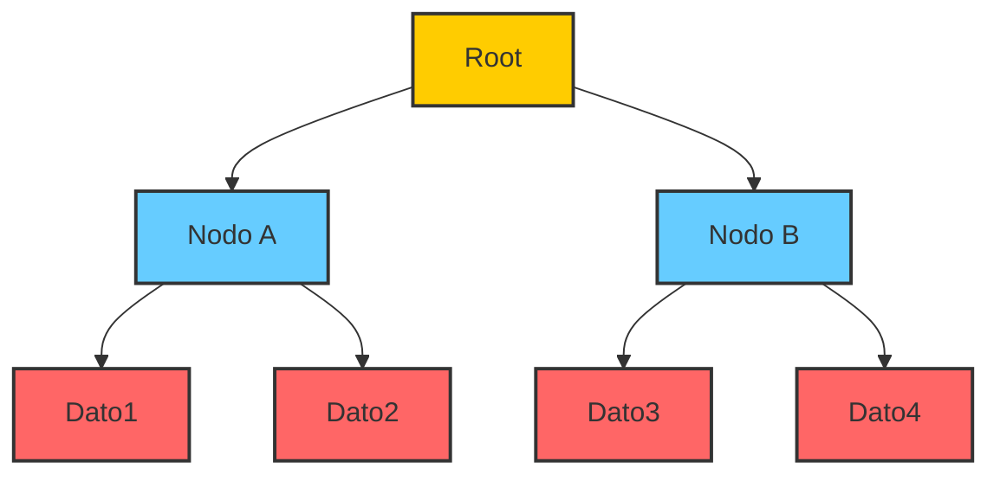
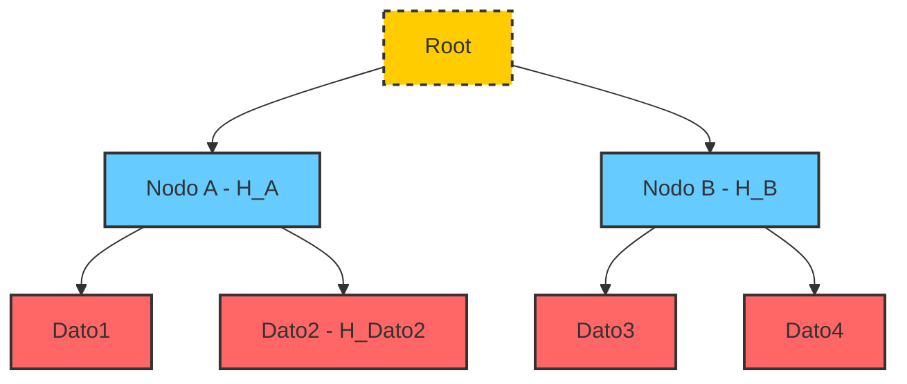

#  Merkle Trees y Merkle Proofs 
Son conceptos relacionados que permiten gestionar y verificar grandes conjuntos de datos de manera eficiente.

## Merkle Trees
Un ``Merkle Tree`` es una estructura de datos en forma de árbol binario que se utiliza para resumir y verificar grandes conjuntos de datos. Cada nodo del árbol representa un conjunto de datos y contiene un resumen ``(o "hash")`` de los datos que se encuentran en ese nodo.

- Aquí hay una representación simplificada de un ``Merkle Tree``:

Cada nodo del árbol tiene un identificador único y un resumen (hash) de los datos que se encuentran en ese nodo. El resumen se calcula mediante una función de hash que toma como entrada los datos del nodo.

# Merkle Proofs

Un ``Merkle Proof`` es una prueba que demuestra que un dato específico se encuentra en un conjunto de datos resumido por un ``Merkle Tree``. La prueba consiste en una secuencia de nodos del árbol que conectan el nodo raíz con el nodo que contiene el dato específico.

- Aquí hay un ejemplo de cómo se podría construir un ``Merkle Proof`` para demostrar que el dato ``"Dato2"`` se encuentra en el conjunto de datos:

La prueba consiste en la secuencia de nodos que conectan el nodo raíz con el nodo que contiene el dato ``"Dato2"``. La prueba se puede verificar calculando el resumen (hash) de cada nodo y comparándolo con el resumen almacenado en el nodo anterior.
