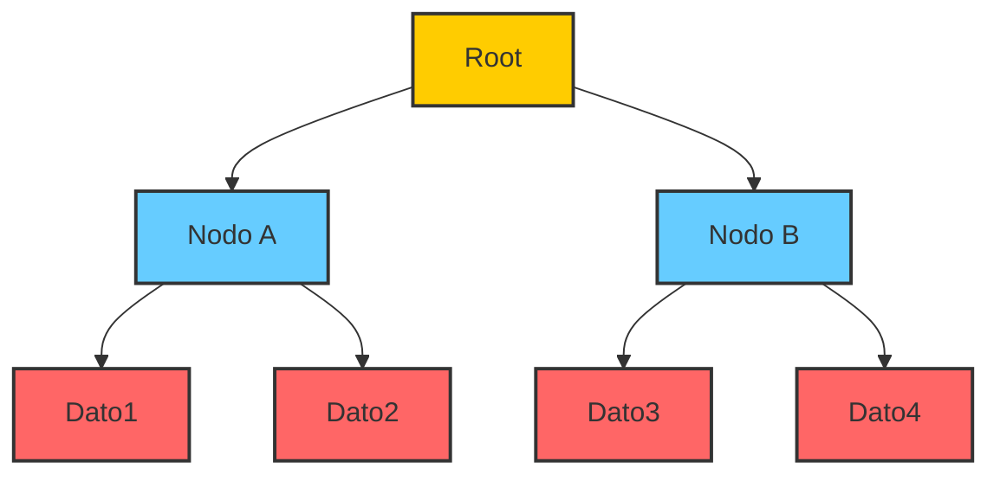
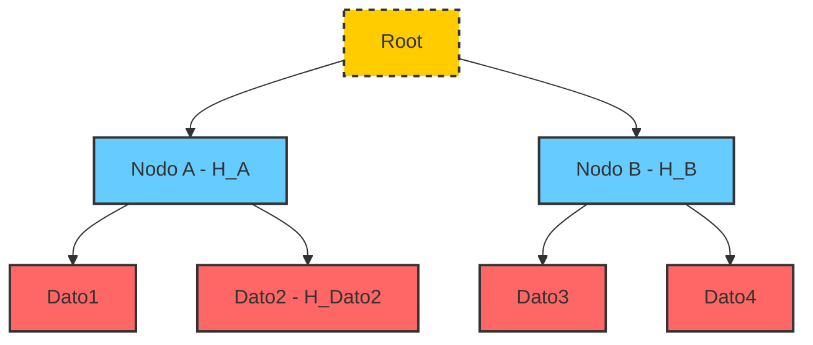

# Merkle Trees and Merkle Proofs
These are concepts that help manage and verify large sets of data efficiently.

## Merkle Trees
A ``Merkle Tree`` is a data structure that looks like a binary tree and is used to summarize and verify large amounts of data. Each node in the tree represents a set of data and contains a summary (or "hash") of the data in that node.

- Here’s a simplified representation of a Merkle Tree:

Each node in the tree has a unique identifier and a summary (or "hash") of the data in that node. The summary is created using a hash function, which takes the data from the node as input.

## Merkle Proofs
A ``Merkle Proof`` is a way to show that a specific piece of data is part of a larger set of data summarized by a M``erkle Tree``. The proof involves a sequence of nodes from the tree that connects the root node to the node containing the specific data.

- Here’s an example of how a ``Merkle Proof`` might be constructed to show that the data ``"Dato2"`` is in the set:

The proof consists of the sequence of nodes that connect the root node to the node containing the data ``"Dato2"``. You can verify the proof by calculating the summary (hash) of each node and comparing it with the summary stored in the previous node.