# 📝 Here's a simpler explanation of how signatures work in the MerkleAirdrop contract:

```mermaid
graph TD
    %% Definición de los nodos principales
    A[Signature Process in MerkleAirdrop] --> B[Granting Permission]
    A --> C[Signature Verification]
    A --> D[Claim Validation]

    %% Detalles de Granting Permission
    B --> B1[Account creates a message]
    B --> B2[Signs the message with private key]
    B --> B3[Generates a unique signature]

    %% Detalles de Signature Verification
    C --> C1[Third party calls claim function]
    C --> C2[System checks the signature]
    C --> C3[Verifies it matches the account]

    %% Detalles de Claim Validation
    D --> D1[Signature is validated]
    D --> D2[Account is listed in Merkle Tree]
    D --> D3[Tokens are airdropped]

    %% Estilos para mejorar la visualización
    style A fill:#f9f,stroke:#333,stroke-width:4px
    style B fill:#bff,stroke:#333,stroke-width:2px
    style C fill:#cfc,stroke:#333,stroke-width:2px
    style D fill:#fcc,stroke:#333,stroke-width:2px

    %% Estilos adicionales para detalles
    style B1 fill:#ddf,stroke:#333,stroke-width:1px
    style B2 fill:#ddf,stroke:#333,stroke-width:1px
    style B3 fill:#ddf,stroke:#333,stroke-width:1px
    style C1 fill:#dfd,stroke:#333,stroke-width:1px
    style C2 fill:#dfd,stroke:#333,stroke-width:1px
    style C3 fill:#dfd,stroke:#333,stroke-width:1px
    style D1 fill:#fdd,stroke:#333,stroke-width:1px
    style D2 fill:#fdd,stroke:#333,stroke-width:1px
    style D3 fill:#fdd,stroke:#333,stroke-width:1px
```

* **Granting Permission**: If someone wants to let another person claim tokens for them, they write a message saying so. They then use their private key to sign this message, creating a special "signature" that proves they gave permission.

* **Signature Verification**: When the other person tries to claim the tokens, the contract checks the signature. It makes sure that the signature really comes from the person who owns the tokens and that they agreed to let someone else claim them.

* **Claim Validation**: If the signature is correct and the owner is listed in the Merkle Tree, the claim is approved, and the tokens are sent to the owner.

> This process ensures that only the right people can claim the tokens.